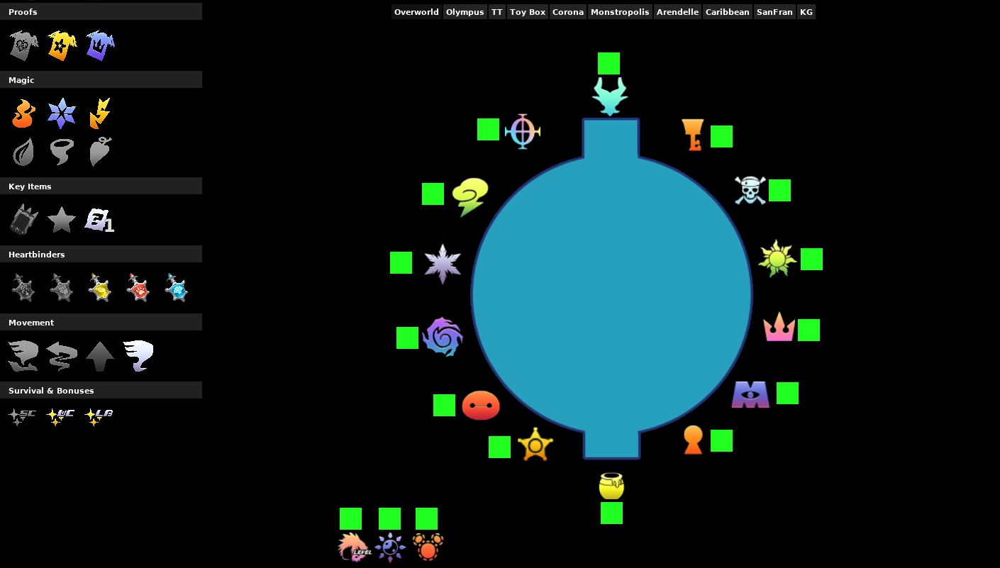

# KH3 Archipelago PopTracker Pack
A PopTracker pack for Kingdom Hearts III Archipelago randomizer.

## Installation
1. Download and extract to your PopTracker `packs/` directory
2. Open PopTracker and select "Kingdom Hearts III Archipelago"
3. Connect to your AP server for auto-tracking

## Logic
The KH3 AP world currently has minimal logic — only the final door requires all three Proofs. All other locations are accessible from the start via the Garden of Assemblage hub.

## Credits
Built for use with the KH3 Archipelago alpha APWorld developed by Aesais.
